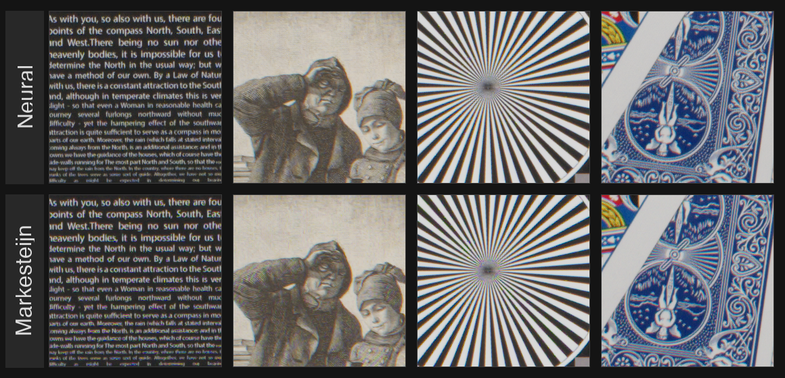

# Neural Demosaic


**PackedXTransNet** — a neural demosaicing model for Fujifilm X-Trans sensors.

X-Trans uses a 6×6 color filter array instead of the standard 2×2 Bayer pattern, which is more complex to demosaic than Bayer. This model learns to invert the mosaicing directly, outperforming Markesteijn in PSNR while demosaicing a 40MP RAW file in **0.6 seconds on M1 Pro** (CoreML).

Trained on a personal dataset of ~100 RAW files. A full training run takes 10–20 minutes on a Mac.

## Setup

```bash
uv sync
```

## Workflow

**1. Prepare ground truth** from your RAW bayer files (DNG, NEF, CR2/3, ARW):

```bash
uv run scripts/prepare_raw.py path/to/raws/ -o data/gt
```

This superpixel-demosaics each file and Lanczos-downscales in linear space to suppress aliasing. Output: `data/gt/*.npy` (float16 linear RGB).

**2. Train:**

```bash
uv run scripts/train.py
```

Trains for 50k steps, logs PSNR vs bilinear and Markesteijn baselines every 500 steps, saves best checkpoint to `weights/packed.pt`.

**3. Inference** (PyTorch, tiled):

```bash
uv run scripts/inference.py
```

Runs tiled inference with crop-discard margins, applies color matrix + ACES tonemap + sRGB gamma, saves to `output/result.png`. Edit `RAF_PATH` and `CKPT` at the top of the script.

You can get a sample raw file [here](https://www.dpreview.com/reviews/image-comparison).

**4. Export to CoreML** (Apple Silicon):

```bash
uv run scripts/export_coreml.py
```

Traces the model for a fixed tile size, converts to fp16 CoreML targeting the Neural Engine, then benchmarks. Edit `CKPT` and `OUT` paths at the top.

**5. CoreML inference:**

```bash
uv run scripts/inference_coreml.py
```

## Future work

- Synthetic data to improve high-frequency detail reproduction
- Joint demosaic + denoise via noise-augmented training
